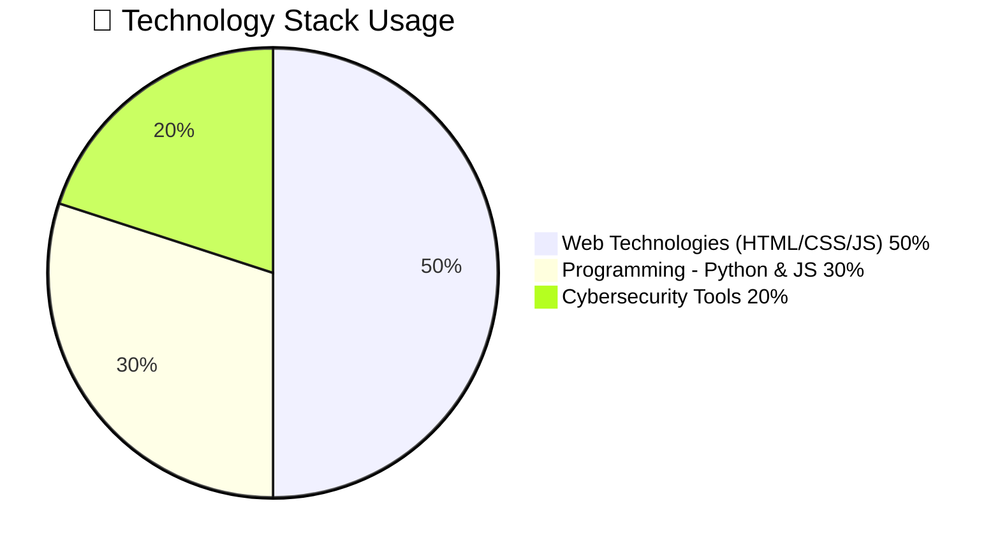
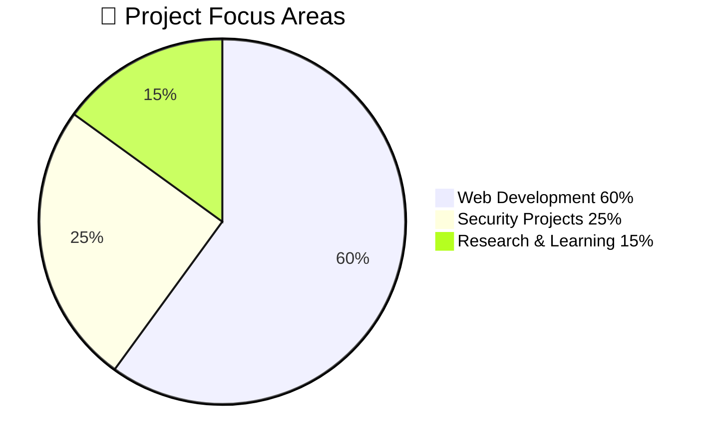
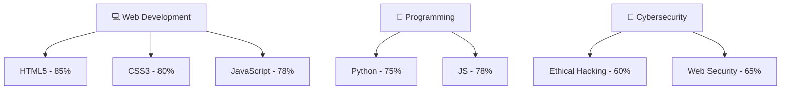

 

 
 

---
 
## 👨🏻‍💻 About Me
 

- 🎓 **B.E. Computer Science Engineering** student at **SKP Engineering College** (2023–2027, currently in 3rd Year)
- 💻 **Junior Web Developer** with **1 year of experience** building responsive, secure websites
- 🛡️ **Cybersecurity Intern** at **CyberWolf Company** — gaining hands-on web security experience
- 🔐 Skilled in **Ethical Hacking** & **Web Security**
- 🚀 Passionate about **innovation**, **continuous learning**, and **problem-solving**
- 🌍 Based in **Tiruvannamalai, Tamil Nadu, India**
- 📫 Reach me at **praveenmurugan2005@gmil.com**
- 📞 **+91 8525032410**
 
---
 
## 📊 Professional Statistics
 

 

### 📈 Tech Stack Distribution
 

 
### 🎯 Focus Areas
 

 

---
 
## 🛠️ Technology Arsenal
 

### 🌐 Web Technologies

### 💻 Programming Languages

### 🔐 Cybersecurity

### ⚙️ Tools & Platforms

---
 
## 📊 Skill Proficiency
 

 

---
 
## 🏆 Featured Projects
 

<table>
  <tr>
    <td width="50%">
      <h3 align="center">🏋️ Bachelors Fitness & Food</h3>
      

        
        
          
        
<strong>🚀 Features:</strong>

        

          ✅ Workout Plans & Diet Suggestions 
          ✅ Health Tracking Dashboard 
          ✅ Clean, Responsive UI 
          ✅ Healthy Lifestyle Guidance
        

        
<strong>🛠️ Tech:</strong> HTML · CSS · JavaScript

      

    </td>
    <td width="50%">
      <h3 align="center">✅ To-Do List Application</h3>
      

        
        
          
        
<strong>🚀 Features:</strong>

        

          ✅ Add, Update & Delete Tasks 
          ✅ Clean Minimal Interface 
          ✅ Daily Productivity Tracker 
          ✅ Fully Responsive Design
        

        
<strong>🛠️ Tech:</strong> HTML · CSS · JavaScript

      

    </td>
  </tr>
</table>

---
 
## 💼 Experience
 

### 🔐 Internship Experience
 
| Role | Company | Duration | Status |
|------|---------|----------|--------|
| 🛡️ **Cybersecurity Intern** | [CyberWolf Company](https://cyberwolf.pro) | Ongoing | 🟢 Active |
| 💻 **Junior Web Developer** | Self / Freelance | 2024–2026 | 🟢 Active |
 

### 🔐 CyberWolf Company — Cybersecurity Intern *(Ongoing)*
 
- 🌐 Currently gaining hands-on experience in **cybersecurity** and **web security**
- 🛡️ Working on real-world security challenges and web vulnerability assessments
- 🔗 Company: [https://cyberwolf.pro](https://cyberwolf.pro)
### 💻 Junior Web Developer *(2024 – 2026)*
 
- 🚀 Built **responsive websites** using modern web technologies
- ⚡ Focused on **performance**, **security**, and **scalability**
- 📦 Delivered reliable, high-quality web solutions
---
 
## 🎓 Education
 

| Degree | Institution | Year | Status |
|--------|------------|------|--------|
| 🎓 **B.E. Computer Science Engineering** | SKP Engineering College | 2023 – 2027 | 🟡 3rd Year |
 

---
 
## 🌐 Connect & Collaborate
 

  
 

  
 

  
 

  
 

### 🌍 Location

### 💼 Open for Opportunities

---
 
## 📈 GitHub Stats
 

 

 

---
 

### 💡 *"Code with purpose, secure with passion, build with precision."*
 

 
